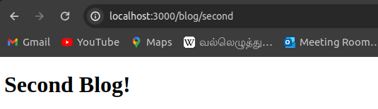

# Next.js Learning

<h1> What is NextJs ? </h1>


<h1> Reasons to learn Nextjs framework</h1>


<h1> Creating & running nextJs application</h1>

- We should run the command , `create next-app` to create the brand new next application in terminal.

* The terminal will prompt wheather proceed with installing the nextJs packages for sure. Provide `y` to continue

* Then the terminal will prompt for project name that need to be used. We should type the valid project name.

* Next the terminal will prompt for list of continous YES or NO questions for wheather to use typescript , ESLint , Tailwind css , src directory , App router and customized default import alias. Choose the required choices. ( Except for customize import alias question , remaining should be answered as "YES)

* Once finished aswering for all the above questions, a new nextjs project will be avilable in the folder.


- To run the application , we should naviage to the project folder and run the command : `npm run dev`

* Once the command is run the application will be avilable in http://localhost:3000 in the browser.

<h1> Project structure </h1>

- Usually the inital project folder will contain the four folders and 10 files within it.

<h4>package.json file</h4>

- It is responsible for necessary dependancies like react , react-dom and next.

- It also contains other dev-dependencies like eslint , tailwind css , typescript , autoprettier and so on based on the answes we provide while installing the next app.

- It also has th scripts for running , building this next application. And the server side start script and lint script also availbalein the script section.

<h4>package-lock.json file</h4>

- Contains all meta on every packages available in package.json file.

<h4>.eslintrc.json file</h4>

- Configuration file for es-lint

<h4>.gitignor file</h4>

- To handle version controlling

<h4>next-env.d.ts file</h4>

- Typescript declarations for next project.

<h4>Some configuration files</h4>

- next.config.mjs file --> next configuration file.

- postcss.config.js file , tailwind.config.ts --> tailwind css configuration file.

* tsconfig.json --> type-script configuration file.

<h4> README.md </h4>

- The documentation file which explains how to set up and run the application and other important information which is important.

<h4>.next folder <h4>

- This folder is generated when we run the script `npm run dev` or `npm run build`.

- This is responsible to serve this application in both development and production environments.

- This file is gitignored. So need not to worry about thid during development.

<h4> node_modules folder </h4>

- In this folder all the dependencies are get installed.

* It can be installed with `npm i` script but usually when we run , `npm run dev` script it should be get installed.

* This is also gitignored.

<h4>Public folder</h4>

- This is an inportant folder which should contain all the static assets like images , svg's , videos or audios etc.

<h4>src folder</h4>

- It is the project's very important folder. All the logics and UI part will be developed under this folder.

* It has `app` folder which is responsible for advanced routing.

* The app folder contains the below four files.

  - favicon.ico --> Icon of the web-page in browser tab.

  - globals.css --> Responsible for application's global styles.

  - layout.tsx --> It has the UI that can be shared across different pages of the application.

  * page.tsx --> It is also returns the UI which is actually passed as children prop to th layout.tsx file. This is responsible for overall application's view.

<h1> Application control flow ( package.jsin to page.tsx ) </h1>

- When we execute the script `npm run dev` in terminal inorder to run the application, The flow immediately transfereed package.json to to `layout.tsx file`.

* In the layout.tsx file,there is a function named `Rootlayout` which returns the main `html` and `body` tags. This RootLayout function/component accepts the children prop. The children prop is used in the body tag.

* Then flow tranferred to the page.tsx file. In page.tsx file, any UI or json can be returned and this JSX is passed as children prop in layout.tsx file's RootLayout function. And the application is updated with the UI in the page.tsx file.

<h1> React server components introduction </h1>


<h1> Routing </h1>

<h2> Routing Introduction</h2>


<h2>Routing conventions</h2>


<h2>In Practice:</h2>

- As routing convention says, to implment a main page where `http://<domainname>` is rendered in browser, that component should be named as `page.tsx/page.ts` and UI should be defined in that component.

- This page.tsx should be placed under `app` folder. While doing this layout.tsxis automatically generated by the nextjs.

* For another routings we should create new folders under app folder. Inside the route folders , every component file must be named with `page.tsx` to render the component in that route correspondigly.

* Nextjs handles undefined route itself. If any route is not defined in the project is triggeredin browser then nexjs will throw the default `Page not found` page. No need to handle this logic seperately.

* Example Folder structure :

```js

| src
--|app
  |--| about
  |    page.tsx --> ABOUT COMPONENT
  |--| profile
      page.tsx --> PROFILE COMPONENT
   layout.tsx
   page.tsx    --> HOME COMPONENT
```

<h4> Results :</h4>

<h5> Home route</h5>


<h5> about route</h5>


<h5> profile route</h5>


<h5> invalid route</h5>


<h1> Nested routes</h1>

- Nested routes are basically consist of may children routes within one parent route as below scenario shows:


- To achieve nested routing in the nextjs application, we should adjust the folder structures based on the expected behaviour.

- Since nextjs is a folder structure based routing machinism, it allows nested routing with `nested folders with page.tsx files each consist their own component`

* Folder structure needed to achive the scenario3 :

```js
| src
--|app
  |--| blog
     |--| first
     |      page.tsx   --> FIRST BLOG COMPONENT
     |--| second
            page.tsx   --> SECOND BLOG COMPONENT
       page.tsx        --> BLOG COMPONENT
  |
  |--| about
  |    page.tsx --> ABOUT COMPONENT
  |--| profile
      page.tsx --> PROFILE COMPONENT
   layout.tsx
   page.tsx    --> HOME COMPONENT

```

<h4> Resuls for nested components</h4>

<h5>Parent route</h5>


<h5>Child 1 route</h5>


<h5>Child 2 route</h5>


<h1> Dynamic routes</h1>

- When application's path is not known priorly then dynamic route implementation should come into play.

* Mostly When implementing list page and a detail page based on the selectedId from list is the common scenario where dynamic route is used.

* Below is one of the sample scenario:


<h2> Implementing dynamic route </h2>

- Usually we implement nested route by creating nested folder structure in the app route.

- But If the nested route path is unkown or it is dynamic we should not implement those routes using usual nested route approach.

* So to set the specific route to be dynamic, we should `wrap the folder name with square bracks []` and pass the common name for the unique values inside square bracks. This will convert some specific route to accept any child route and render the same page.tsx file inside that dynamic route for all it's children.

* To fetch the dynamic route value in the component ( page.tsx file inside the dynamic route folder ) we should follow the below steps.

* Every page.tsx file inside app router folder will recive the params as props.

* The params prop is an object and it will contain the dynamic route value in the common name we defined inside the square bracs.

* So we can now destructure the page.tsx file inside dynamic route to get the params prop and use the route value simply calling the common name.

* For example:

### prodctsList component:

```js
export default function ProductList() {
  return (
    <>
      <h1> Product List</h1>
      <h2> Product 1</h2>
      <h2> Product 2</h2>
      <h2> Product 3</h2>
    </>
  );
}
```

### productDetail component:

```js
export default function ProductDetails({
  params,
}: {
  params: {
    productId: string,
  },
}) {
  return <h1> Product Details {params.productId}</h1>;
}
```

<h2> Dynamic route structure</h2>

```js
| src
--|app
  |--| products
        | --| [productId]  --> PRODUCT DETAIL COMPONENT ( DYNAMIC ROUTE )
              page.tsx
       page.tsx         --> PRODUCT LIST COMPONENT
  |--| blog
     |--| first
     |      page.tsx   --> FIRST BLOG COMPONENT
     |--| second
            page.tsx   --> SECOND BLOG COMPONENT
       page.tsx        --> BLOG COMPONENT
  |
  |--| about
  |    page.tsx --> ABOUT COMPONENT
  |--| profile
      page.tsx --> PROFILE COMPONENT
   layout.tsx
   page.tsx    --> HOME COMPONENT
```

<h4> Dynamic routes : Sample screen shots </h4>

<h5> Products list</h5>


<h5> Product detail route ( sample 1 )</h5>


<h5> Product detail route ( sample 2 )</h5>


<h1> Nested dynamic routes</h1>

- Nested dynamic routes mean having another dynamic route inside a dynamic route.

* To understand bettwe we can look below scenario:


- To handle this scenario we can simply nest the second synamic route inside the dynamic route we already have.

* For example to handle the above scenario, we should create a new route named `reviews` inside the [productId] folder which is already a dynamic route.

* And inside the reviews folder, we should then create anothe dynamic route folder by wrapping the folder name with square bracs as we usually create dynamic route. In this we should create like [reviewId]

* Inisde the newly created dynamic route folder [reviewid], we can write our component logic with page.tsx file.

* So in the page.tsx file we can then receive the dynamic route values in props and we can access it.

<h2> Dynamic route structure</h2>

```js
| src
--|app
  |--| products
        | --| [productId]  --> PRODUCT DETAIL COMPONENT ( DYNAMIC ROUTE )
                |--> reviews
                      |--> [reviewId]
                           page.tsx     --> Review Component
              page.tsx
       page.tsx         --> PRODUCT LIST COMPONENT
  |--| blog
     |--| first
     |      page.tsx   --> FIRST BLOG COMPONENT
     |--| second
            page.tsx   --> SECOND BLOG COMPONENT
       page.tsx        --> BLOG COMPONENT
  |
  |--| about
  |    page.tsx --> ABOUT COMPONENT
  |--| profile
      page.tsx --> PROFILE COMPONENT
   layout.tsx
   page.tsx    --> HOME COMPONENT
```

<h4> Nested Dynamic routes : Sample screen shots </h4>

<h5> REviews sample 1 </h5>


<h5>Reviews sample 2</h5>


<h1> Catch-all segments </h1>

- Catch-all segments is another routing concept. Let us consider the below scenario to understand Catch-all segement.


<h2> Implementing Catch-all segments </h2>

- To implement a catch-all segment route, first we need to identify the segement.

* segemnt also means a route which is the first and rest of the following routes will should only come after the segmant path.

* For example : `http://docs/feture1/concept1/` . Here, if we want to catch all after docs route we should identify the `docs` as segment route.

* Once we idntified the segemnt route we should create a folder with that segmanr name within app folder as usual routes.

* To implement catch-all segement to docs route, we should cretae another folder inside docs folder with unique name.

* As this folder is responsible for all children routes that follows, the name must be unique and should meet with convention for segement route.

* The name must inside square bracs. Inside square bracs spread operator should be used. Following the spread operator the name of our choice will be used.

* For the example , I provided the name as `[...slug]`

* Inisde the segemnt folder we should create a page.tsx file as normal component which return some JSX.

* Now this page.tsx file is responsible for all routes that inclused docs segemnt in it. This component is renderd for every route which has docs within it.

* As the page.tsx is responsible for the UI for docs section, we can then conditionally render different JSX inside this component.

* We can access the values of routes and values inside the component using params props. In the params prop, we can get access for the slug array ( In this specific case only. it is based on the name we use. In this example i have used slug ) and using that array and length we can conditionally render UI's .

### page.tsx inside [...slug] folder which is kept under docs route folder:

```
export default function Docs({
  params,
}: {
  params: {
    slug: string[];
  };
}) {
  if (params.slug?.length === 2) {
    return (
      <h1>
        viewing docs for feature {params.slug[0]} and concept {params.slug[1]}
      </h1>
    );
  } else if (params.slug?.length === 1) {
    return <h1>viewing docs for feature {params.slug[0]}</h1>;
  } else {
    return <h1>Docs HOME</h1>;
  }
}

```

<h2>NOTE</h2>

- This page.tsx inside the catch-all segment route folder will not provide UI for empty `/docs` route without any children. It will fall for default pagenot found page.

* If we need to handle this situation and expects to provide UI for `/docs` routes without any children, we should follow the `optional catch-all segments`.

* optional catch-all segments means that we should wrap the already available catch-all segemnt route folder ( [...name] ) with another `[]` and the resultant folder name should be `[[...name]]`

* So in this case we can handle condition inside the page.tsx file to render the different UI for empty catch-all segment route. In our example I have just loaded DOCS HOME h1 tag in it.

<h3>Screen shots</h3>

<h4>Sample 1 : One child </h4>


<h4>Sample 2 : Two child </h4>


<h4> Optional catch-all segment Sample </h4>

